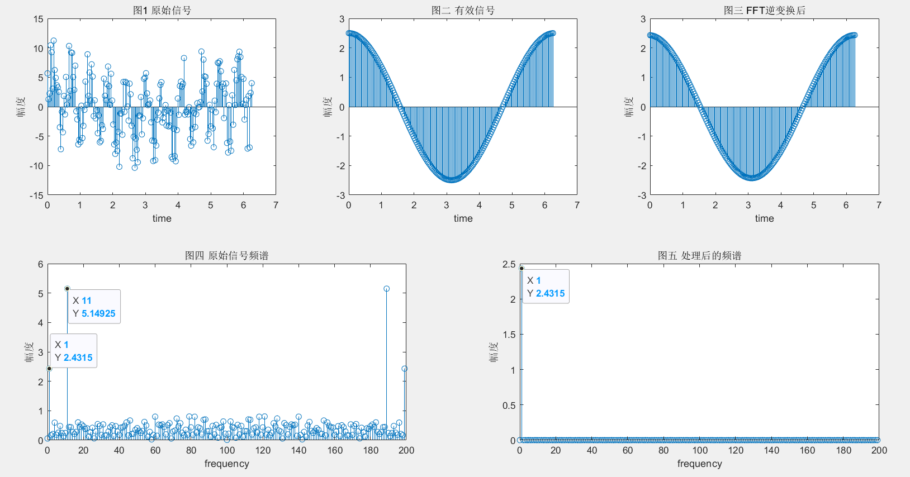
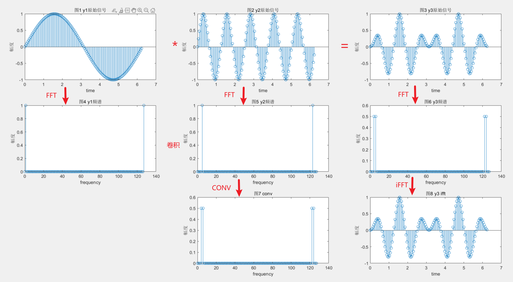

# FFT和IFFT验证记录

## FFT 验证

原始输入信号为：$\ y = 2.5sin(2\pi ft + 0.5\pi) + 5.5sin(22\pi ft) + 10rand()-5 $

有效信号为：$\ 2.5sin(2\pi ft + 0.5\pi)$ 

干扰信号为：$\ 5.5sin(22\pi ft) + 10rand()-5 $，其中：$\ 10rand()-5 $ 表示产生一个-5到5的随机数。

验证目的时得到有效信号，滤除干扰信号

Matlab 代码如下所示：


```matlab
f = 1; %输入信号频率为1Hz
Fs = 200; % 采样频率
NT = 1;% 采样周期数
N = Fs/f*NT; %采样个数
t = 0:NT/N:NT*(N-1)/N;

y = 2.5*sin(2 * pi * f * t+0.5*pi)+5.5*sin(2 * pi * f * 11*t)+10*rand(1,N)-5; % 原始信号
yy = 2.5*sin(2 * pi * f * t+0.5*pi);% 有效信号

y_fft = fft(y, N); %快速傅里叶变换
freq = Fs / N * (0 : (N - 1)); % 频率

subplot(231)
stem(2*pi*t, y);
title('图1 原始信号'),xlabel('time'),ylabel('幅度')

subplot(232)
stem(2*pi*t, yy);
title('图二 有效信号'),xlabel('time'),ylabel('幅度')

subplot(223)
abs_y_fft_before = abs(y_fft / N * 2);
stem(freq, abs_y_fft_before);
title('图四 原始信号频谱'),xlabel('frequency'),ylabel('幅度')

for k=0:N-1 % 保留有效信号频谱
    if(k ~= 1)
       y_fft(k+1)= 0+0i;
    end
end

subplot(224)
abs_y_fft_after = abs(y_fft / N * 2);
stem(freq, abs_y_fft_after);
title('图五 处理后的频谱'),xlabel('frequency'),ylabel('幅度')

y_ifft = ifft(y_fft, N); %快速傅里叶逆变换

subplot(233)
stem(2*pi*t, 2*real(y_ifft)); %必须乘以2，处理频谱时保留了一半
title('图三 FFT逆变换后'),xlabel('time'),ylabel('幅度')
```

运行代码后图形如下：



图一为原始信号，原始信号中包含有效信号和干扰信号

图二为有效信号，一个周期内采样200个点，信号为2.5V，1Hz的正弦波

图四为图一的频谱，FFT变换。从图中可以看出，信号中包含有效信号（1Hz）外，还包含一个11Hz和其他干扰。

图五为处理后的频谱，只保留1Hz的有效信号，其余滤除

图三为图五FFT逆变换后的结果

存在的问题

- 由于加入了随机数，导致信号的幅度会随机偏大或者偏小，例如上图中，有效信号幅度为2.5V，还原后的信号幅度为2.4315V


## 卷积验证

原始信号如下：
$$
y_1(x)~ = sin(2{\pi}x)
$$

$$
y_2(x) = sin(10{\pi}x)
$$

$$
y_3(x) = y_1(x)*y_2(x) = sin(2{\pi}x)sin(10{\pi}x)
$$

matlab验证如下：


图4为$y_1(x)$的频谱，图5为$y_2(x)$的频谱，图6为$y_3(x)$的频谱，图8为图6做FFT逆变换的结果

图7为图4和图5卷积的结果，可以看出图7和图6是一样的。图7做FFT逆变换，结果也为图8

以上验证如下结论：

- <font color = red>时域的相乘等于频域的卷积</font>

以下为上图matlab代码：

```matlab
f = 1; %输入信号频率为1Hz
Fs = 128; % 采样频率
NT = 1;% 采样周期数
N = Fs/f*NT; %采样个数
t = 0:NT/N:NT*(N-1)/N;

y1 = sin(2*pi*t);
y2 = sin(10*pi*t);
y3 = y1 .* y2;%时域相乘

y1_fft = fft(y1, N); %快速傅里叶变换
y2_fft = fft(y2, N); %快速傅里叶变换
y3_fft = fft(y3, N);
y3_conv = cconv(fftshift(y1_fft),fftshift(y2_fft),N)/N;%频域卷积
y3_ifft = ifft(y3_conv);

freq = Fs / N * (0 : (N - 1)); % 频率

subplot(331)
stem(2*pi*t, y1);
title('图1 y1原始信号'),xlabel('time'),ylabel('幅度')

subplot(332)
stem(2*pi*t, y2);
title('图2 y2原始信号'),xlabel('time'),ylabel('幅度')

subplot(333)
stem(2*pi*t, y3);
title('图3 y3原始信号'),xlabel('time'),ylabel('幅度')

subplot(334)
abs_y_fft_before = abs(y1_fft/N*2);
stem(freq, abs_y_fft_before);
title('图4 y1频谱'),xlabel('frequency'),ylabel('幅度')

subplot(335)
abs_y_fft_before = abs(y2_fft/N*2);
stem(freq, abs_y_fft_before);
title('图5 y2频谱'),xlabel('frequency'),ylabel('幅度')

subplot(336) 
abs_y_fft_before = abs(y3_fft/N*2);
stem(freq, abs_y_fft_before);
title('图6 y3频谱'),xlabel('frequency'),ylabel('幅度')
hold on 

subplot(339)
stem(2*pi*t, real(y3_ifft));
title('图8 y3 ifft'),xlabel('time'),ylabel('幅度')
%freq = Fs / N * (0 : 2*(N - 1)); % 频率
subplot(338)
stem(freq, abs(y3_conv)/N*2);
title('图7 conv'),xlabel('frequency'),ylabel('幅度')
hold off
```


## vavido FFT IP核使用记录

IP核配置如下：


如果勾选 Run Time Configurable Transform Length，则Transform Length 需要在8~512之间，不勾选则固定为设置值512

